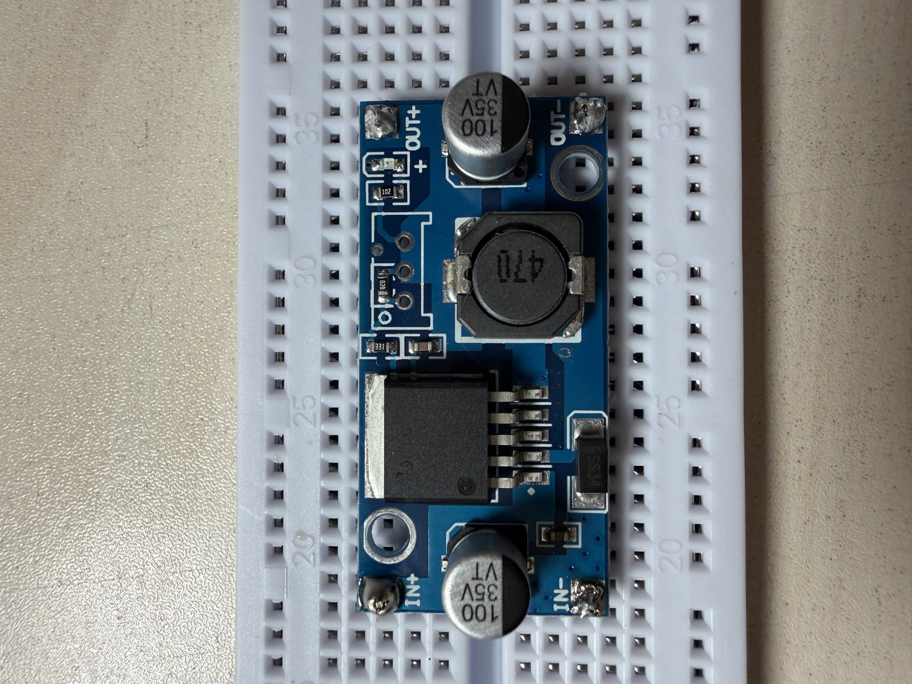

# Self-Balancing Robot

A two-wheeled self-balancing robot built from scratch over 25 days, as a first
real electronics project. ESP32-S3, a BNO055 IMU, stepper drivers, a PID loop,
and two OLED screens for eyes.

I'm a high-school senior heading into electrical engineering, and before this
project I had never soldered anything. This repo is the engineering record: what
I built each day, what broke, and how I worked out why.

**Status: Day 4 of 25.** The robot does not balance yet.

*Day 1 — LM2596 buck converter, the battery-to-5 V rail for the whole build.*

## What's here

| | |
|---|---|
| [**25-day roadmap**](docs/25-day-roadmap.md) | The plan: daily goals, deliverables, and two deliberate buffer days for the PID phase |
| [**Engineering log**](docs/engineering-log.md) | The reality: what I did, what broke, what I learned — written the same day |
| [`firmware/`](firmware) | My ESP32-S3 sketches, added as each one starts working |
| [`docs/reference/`](docs/reference) | Board pinouts and datasheets I keep coming back to |
| [`tools/`](tools) | `docx2md.py` — re-renders the Word originals into the Markdown above |

The two `.docx` files at the root are the working originals I write in each day;
the Markdown in `docs/` is the readable render of them.

## The build

| Part | Role |
|---|---|
| ESP32-S3-DevKitC-1 (N16R8) | Main controller |
| BNO055 | 9-DOF IMU — pitch angle for the balance loop |
| A4988 ×2 | Stepper drivers |
| SSD1306 ×2 | OLED eyes |
| LM2596 | Buck converter, battery → 5 V |

## Things I got wrong so far

Kept here deliberately — the failures are the useful part.

- **Day 1** — tried to blink the LED by GPIO number; only `LED_BUILTIN` worked. I
  didn't yet understand that `setup()`/`loop()` are the whole program, or how to
  read the board's pinout.
- **Day 2** — the Arduino IDE insisted the port was wrong when it wasn't. Found
  the real one with `ls /dev/cu.*`. Also learned this board won't enter flash
  mode on its own: you have to hold **BOOT** on every upload.
- **Day 3** — wired both OLEDs and only one I2C address appeared. They're
  identical parts sharing address `0x3C`, so the bus can't tell them apart. The
  fix is the ESP32-S3's *second* hardware I2C bus and two `Wire` objects.

## Credit

I'm working from a reference design by **H.M. Phan / Robonyx** to understand how
a build like this fits together. Those files are not redistributed here — see
[docs/reference/THIRD-PARTY.md](docs/reference/THIRD-PARTY.md) for the full
attribution and for the Espressif board documentation.

My own work is MIT licensed — see [LICENSE](LICENSE).
